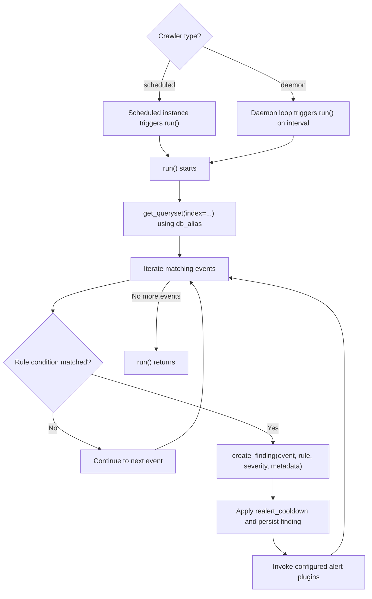

# Writing a Crawler Plugin

Subclass `crawlers.plugins.base.BaseCrawlerPlugin` and implement `run()`. A
scheduled plugin returns after one scan. A daemon plugin owns its loop and uses
its configured interval.

```python
from crawlers.plugins.base import BaseCrawlerPlugin


class ExampleCrawler(BaseCrawlerPlugin):
    def run(self):
        for event in self.get_queryset(index="security"):
            if "example" in event.data.lower():
                self.create_finding(
                    event,
                    rule_name="Example rule",
                    description="Example text found in event data",
                    severity="low",
                )
```

`get_queryset()` uses the instance's `db_alias`. `create_finding()` applies
`realert_cooldown`, stores the finding, and invokes configured alert plugins.
Pass only supported severities: `low`, `medium`, `high`, or `critical`. MITRE
tactic and technique strings are optional.



Register the fully qualified class path in `CRAWLER_PLUGINS`, then add at least
one instance in `CRAWLER_CONFIGS`. The instance `name` must match the plugin name
used by the loader. Choose `type="scheduled"` for bounded work or
`type="daemon"` for a plugin that loops internally.

Test queryset selection, finding content, cooldown behavior, database aliases,
and alert invocation. Run a configured instance once before service mode:

```bash
python manage.py run_crawlers --plugin example_crawler --settings SIEMatic.settings.crawler
```

Plugins must tolerate empty querysets and log actionable errors without
including event secrets or credentials.
