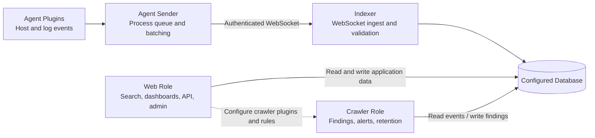

# SIEMatic

SIEMatic is a fair-sourced observability platform built with Django. Pluggable
agents collect host and log events. An authenticated indexer stores them. A
pipeline language searches, transforms, and visualizes the results.

!!! warning "Early-release alpha"
    SIEMatic is under active development and is shipping as an alpha. Interfaces,
    data formats, configuration, and features may change without notice, and
    stability is not guaranteed. Evaluate it in non-production environments. If
    you need to depend on SIEMatic for a production workload, contact
    **sales@mcindi.com** for a paid support contract.

## What SIEMatic provides

- **Collection and indexing:** platform-aware agent plugins send events to an
  authenticated WebSocket indexer, with TLS supported end to end.
- **Search:** an argparse-based pipeline language operates on Django
  QuerySets, pandas DataFrames, and Python records. Commands cover filtering,
  annotation, grouping, statistics, and cross-database joins.
- **Saved searches and dashboards:** users can reuse and share queries, then
  render the results in table or chart panels.
- **Analytics:** continuously running or cron-scheduled crawler plugins create
  findings, attach MITRE ATT&CK context, send alerts, and enforce retention.
- **Administration and APIs:** Django administration, role-based permissions,
  and authenticated REST endpoints support normal operations and automation.

## Architecture

SIEMatic separates runtime responsibilities so they can be deployed and scaled
independently:

1. Agent plugins collect events and place them on a local process queue.
2. The agent sender authenticates to the indexer and sends event batches over a
   WebSocket connection.
3. The indexer validates and stores events in the configured database.
4. The web role serves search, dashboards, findings, administration, and the
   REST API.
5. The crawler role reads events and creates findings or removes expired data.

The [Quickstart](quickstart.md) runs the web, indexer, and agent roles together
for development. The [Operations Guide](operations/index.md) covers the
PostgreSQL-backed Docker Compose deployment.

## Security model

Self-registration is disabled. New users join the `Registered User` group,
which grants read access to events, dashboards, panels, findings, and saved
searches. Dedicated ingest identities belong in the `Agent` group, which grants
permission to create events. Agent credentials must not be shared with an
administrator account.

Web forms use Django CSRF protection. REST endpoints authenticate with session,
Basic, or token authentication and apply request throttles. Production
deployments must use a trusted certificate and a generated secret key. They
must also use `DJANGO_DEBUG=False`.

## License

SIEMatic is distributed under the Business Source License 1.1. Its Additional
Use Grant permits some production use. The grant covers personal use by
individuals and internal use by nonprofit organizations. It also covers
teaching, learning, research, and internal use by educational institutions.
A commercial license is required to offer SIEMatic as a hosted or managed
service. It is also required to embed SIEMatic in a commercial product or
service for third parties.

Each published version changes to Apache License 2.0 four years after its
publication date. The repository `LICENSE` file is authoritative. Commercial
Send commercial licensing inquiries to `sales@mcindi.com`.
