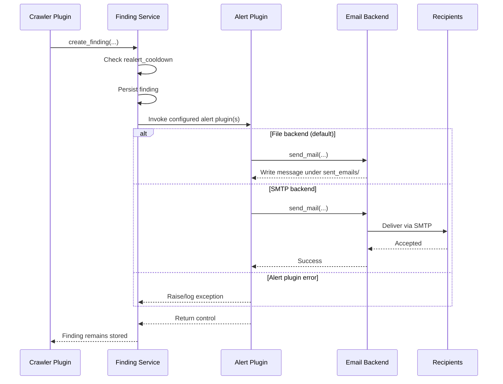

# Alerting

When a crawler creates a finding, it invokes the alerting plugins named in that
crawler instance. SIEMatic includes an email plugin.



## Configure email delivery

Register the plugin and its recipients in `SIEMatic/settings/crawler.py`:

```python
ALERTING_PLUGINS = [
    "crawlers.alerting.email_alert.EmailAlert",
]

ALERTING_CONFIGS = {
    "email_alert": {
        "recipients": ["security@example.com"],
        "from_email": DEFAULT_FROM_EMAIL,
    },
}
```

Enable it on the relevant crawler instance with
`"alerting_plugins": ["email_alert"]`. Recipients are global to that alert
plugin configuration. SIEMatic does not currently provide user-managed alert
subscriptions.

The default email backend writes messages under `sent_emails/`. For SMTP, set
`EMAIL_BACKEND=django.core.mail.backends.smtp.EmailBackend` and configure
`EMAIL_HOST`, `EMAIL_PORT`, credentials, and exactly one of `EMAIL_USE_TLS` or
`EMAIL_USE_SSL`. Set `DEFAULT_FROM_EMAIL` to an accepted sender.

## Check alert delivery

Use a non-production rule that creates a known finding. Make sure that the
finding and the delivered message exist. Alert exceptions appear in the log and
do not undo finding creation. If a message is absent, inspect the crawler logs.
Make sure that the plugin names, recipients, backend configuration, and finding
cooldown are correct.
